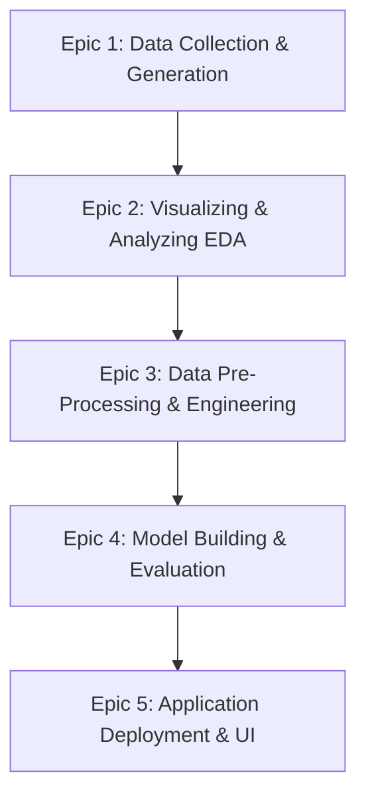

# Credit Card Approval Prediction System

An end-to-end Machine Learning solution designed to evaluate and predict the approval probability of credit card applications. This system includes a synthetic applicant data generator, a comprehensive data preprocessing and feature engineering pipeline, comparative training of multiple classifiers, and an interactive Flask-based web application dashboard for live inference.

---

## 📌 Project Overview
In modern financial institutions, managing risk while maintaining operational efficiency is key. Evaluating credit card applications manually is a resource-intensive, slow, and subjective process. This project implements a fully automated, data-driven system that uses historical customer profiles to predict the risk of default and recommend approval or rejection decisions. 

By building a structured machine learning pipeline (featuring preprocessing, scaling, feature engineering, training, and deployment), this project demonstrates how machine learning models can be integrated into a functional web application to support automated decision-making.

---

## 🎯 Problem Statement
Manual processing of credit card applications leads to:
1. **Inefficiency**: Processing delays that impact customer experience.
2. **Subjective Risk Assessments**: Inconsistencies in manual auditing.
3. **Imperfect Risk Modelling**: The inability to identify complex correlations between credit history, income-to-family ratios, debt loads, and demographic indicators.

**Solution**: Build an automated application scoring system that analyzes client profiles using predictive models, providing an instant decision recommendation with computed risk probabilities.

---

## 🚀 Objectives
* **Data Generation**: Produce realistic credit applicant data containing missing values and duplicate records to simulate real-world data challenges.
* **Data Exploration (EDA)**: Automatically compute statistical metrics and save visualizations of distributions and heatmaps.
* **Pipeline Preprocessing**: Clean duplicates, impute missing fields, and scale/encode variables.
* **Feature Engineering**: Derive advanced indicators (e.g., employment-to-age ratio, income-per-family-member).
* **Model Benchmark & Selection**: Train and compare Logistic Regression, Decision Trees, and Random Forests, and serialize the best pipeline.
* **User Application**: Establish a Flask application with custom CSS templates for a seamless user prediction experience.

---

## ⚡ Features
* **Synthetic Applicant Dataset Generator**: Creates custom applications based on realistic multivariate statistical distributions.
* **Structured Data Preprocessing Pipeline**: Built using Scikit-Learn's `ColumnTransformer` to automate data imputation, scaling, and one-hot encoding.
* **Advanced Feature Engineering**: Introduces custom ratios to maximize model prediction accuracy.
* **Model Compare Engine**: Evaluates three core classifiers using Accuracy, Precision, Recall, F1 Score, and ROC-AUC metrics.
* **Clean Web UI**: A modern interface styled using glassmorphic cards, custom typography, form validations, and transition animations.
* **Real-time Inference Dashboard**: Displays the approval status alongside numerical confidence levels.

---

## 🛠️ Technology Stack
* **Language**: Python 3.11 / 3.13
* **Libraries (ML & Data)**: 
  * NumPy (Advanced Mathematics and Array processing)
  * Pandas (Tabular Data Frame operations)
  * Scikit-Learn (Imputers, Scalers, Categorical Encoders, Classifier models, and Pipelines)
  * Joblib (Object serialization/deserialization)
* **Libraries (Visualizations)**:
  * Matplotlib (Basic plotting backend)
  * Seaborn (Refined statistical charts)
* **Web UI Framework**:
  * Flask (Python WSGI Web Framework)
* **Frontend**:
  * HTML5 (Semantic Structure)
  * CSS3 (Vanilla Custom Styling with CSS Variables, Flexbox/Grid, and Keyframe animations)
  * JavaScript (Client-side validation and transition controls)

---

## 📊 Dataset Description
The system generates and processes a dataset (`credit_card_applications.csv`) containing the following variables:

| Attribute Name | Variable Type | Description |
| :--- | :--- | :--- |
| `gender` | Categorical | Applicant's biological sex (`Male`, `Female`). |
| `owns_car` | Categorical | Flag indicating if applicant owns a car (`Yes`, `No`). |
| `owns_property` | Categorical | Flag indicating if applicant owns real estate (`Yes`, `No`). |
| `children_count` | Numerical | Number of children in the applicant's family. |
| `annual_income` | Numerical | Annual income in USD (logged log-normal distribution). |
| `income_type` | Categorical | Job category (e.g. `Working`, `Pensioner`, `State servant`, etc.). |
| `education` | Categorical | Highest educational qualification completed. |
| `family_status` | Categorical | Marital status (e.g. `Married`, `Single`, `Separated`, etc.). |
| `housing_type` | Categorical | Housing arrangement (e.g. `House / apartment`, `Rented apartment`, etc.). |
| `age` | Numerical | Age of the applicant in years. |
| `years_employed` | Numerical | Total years of professional employment. |
| `mobile_phone` | Binary (0/1) | Whether the applicant provided a mobile phone number. |
| `work_phone` | Binary (0/1) | Whether the applicant provided a work phone number. |
| `email` | Binary (0/1) | Whether the applicant registered a contact email. |
| `family_members` | Numerical | Total count of family household members. |
| `credit_score` | Numerical | FICO-equivalent credit rating (ranging from 380 to 850). |
| `existing_loans` | Numerical | Total number of concurrent loans/credit lines active. |
| `debt_to_income` | Numerical | Ratio representing monthly debt payments divided by monthly income. |
| `approved` | Binary (0/1) | **Target Variable**: 1 = Application Approved, 0 = Application Rejected. |

---

## 📈 Project Workflow
The development is organized into 5 key phases (Epics):



1. **Epic 1: Data Collection & Synthetic Generation**: Creates 1,200+ raw records representing realistic clients with missing fields and duplicate entries to mirror production data.
2. **Epic 2: Visualizing & Exploring Data (EDA)**: Inspects relationships between income, credit history, and approval outcome. Generates charts and descriptive summaries.
3. **Epic 3: Data Preprocessing**: Removes duplicate rows, replaces missing fields using statistical imputations, converts categorical text via one-hot encoding, scales numeric ranges, and appends custom features.
4. **Epic 4: Model Building**: Trains Logistic Regression, Decision Tree, and Random Forest estimators. Records evaluation scores, identifies the best estimator, and serializes the model pipeline to disk.
5. **Epic 5: Application Building**: Launches a web server using Flask. Serves input forms, collects user values, applies the inference pipeline, and visualizes predictions dynamically.

---

## ⚙️ Installation
To set up the project environment on your local system, follow these steps:

1. **Clone/Navigate to the Repository Directory**:
   ```bash
   cd c:\Users\anand kumar\OneDrive\Desktop\Credictcardapprovalpredicationsystem
   ```

2. **Create a Virtual Environment**:
   * Windows:
     ```bash
     python -m venv venv
     ```
   * macOS/Linux:
     ```bash
     python3 -m venv venv
     ```

3. **Activate the Virtual Environment**:
   * Windows (Command Prompt):
     ```cmd
     venv\Scripts\activate.bat
     ```
   * Windows (PowerShell):
     ```powershell
     .\venv\Scripts\Activate.ps1
     ```
   * macOS/Linux:
     ```bash
     source venv/bin/activate
     ```

4. **Install Dependencies**:
   ```bash
   pip install -r requirements.txt
   ```

---

## 💻 Execution
Run the system modules sequentially using the following execution commands:

1. **Phase 1: Generate the Synthetic Dataset**
   ```bash
   python src/data_generator.py
   ```
   *Generates the raw CSV dataset and stores it at `data/credit_card_applications.csv`.*

2. **Phase 2: Preprocess Data, Train Models, and Export Best Model**
   ```bash
   python src/train.py
   ```
   *Applies cleaning, produces visual charts in `reports/figures/`, compares model performances, saves results to `reports/model_comparison.csv`, and outputs model binaries (`best_model.joblib` and `model_metadata.joblib`) into `models/`.*

3. **Phase 3: Launch the Flask Web Application**
   ```bash
   python app.py
   ```
   *Launches the server. Access the prediction web dashboard at `http://127.0.0.1:5000/`.*

---

## 📁 Folder Structure
The following structure organizes the project files and modules:

```text
Credictcardapprovalpredicationsystem/
│
├── data/                             # Data storage (CSV format)
│   └── credit_card_applications.csv  # Generated synthetic dataset
│
├── models/                           # Serialized model binaries
│   ├── best_model.joblib             # Exported scikit-learn pipeline (model + preprocessor)
│   └── model_metadata.joblib         # Model training metadata (performance score, features)
│
├── reports/                          # Analysis output CSV files
│   ├── descriptive_statistics.csv    # Descriptive summaries of the dataset
│   ├── model_comparison.csv          # Benchmark results for all classifiers
│   └── figures/                      # Explanatory charts (EDA plots)
│       ├── approval_distribution.png # Distribution of approved/rejected classes
│       ├── correlation_heatmap.png   # Multi-variable correlation coefficients matrix
│       └── income_by_approval.png    # Histogram of annual income relative to approval
│
├── src/                              # Machine learning logic packages
│   ├── __init__.py                   # Package initializer
│   ├── data_generator.py             # Logic to generate synthetic data
│   ├── preprocessing.py              # Data cleaning and feature engineering modules
│   ├── train.py                      # Models comparison and training pipeline orchestrator
│   └── predict.py                    # Inference wrapper loader for the web backend
│
├── static/                           # Public assets for the UI
│   ├── css/
│   │   └── styles.css                # Premium styling custom layout definitions
│   └── js/
│       └── app.js                    # Form validation and dynamic transitions code
│
├── templates/                        # Web templates for Jinja rendering
│   ├── base.html                     # Standard layout header, footer, metadata skeleton
│   ├── index.html                    # Application details entry form
│   └── result.html                   # Prediction evaluation presentation dashboard
│
├── app.py                            # Flask application router and backend routes
├── requirements.txt                  # List of pinned dependencies
└── README.md                         # Project documentation (this file)
```

---

## 🔮 Future Scope
* **Explainable AI (XAI)**: Integrate libraries like `SHAP` or `LIME` into the Flask dashboard to explain to users why a specific application was approved or rejected (feature contribution analysis).
* **Database Integration**: Connect the Flask backend to a structured SQL database (like SQLite or PostgreSQL) to save applicant inputs and historical model predictions.
* **Authentication Modules**: Implement secure user registration and roles (e.g., Client login vs. Credit Manager audit panel).
* **Cloud Deployment**: Containerize the application using Docker and deploy it onto cloud infrastructures such as IBM Cloud, AWS, or Heroku.

---

## 🎓 IBM SkillsBuild Compatible Documentation
This project is designed to align with IBM SkillsBuild project portfolios by executing key data science guidelines:
* **Separation of Concerns**: Complete decoupling of raw data generation (`data_generator.py`), pipeline processing (`preprocessing.py`), model comparison (`train.py`), and web deployment (`app.py`).
* **Reproducibility**: All random sampling, split states, and estimators are bound to a strict random seed value of `42` to ensure consistent execution behavior across all runs.
* **Complete Preprocessing Pipelines**: Categorical variables are correctly one-hot encoded, and numerical scales are standard-scaled. All imputations are executed inside Scikit-learn pipelines to prevent data leakage during train/test splits.
* **Actionable Business Metrics**: The system outputs standard classification criteria (Accuracy, Precision, Recall, F1, and ROC-AUC) so users can analyze trade-offs between credit risks and approval volume.
